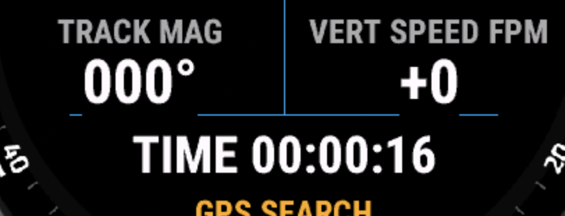
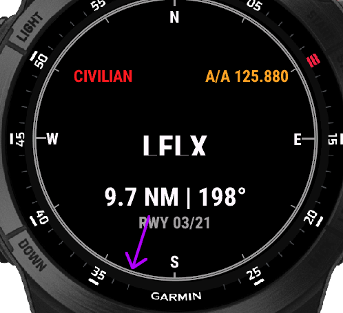
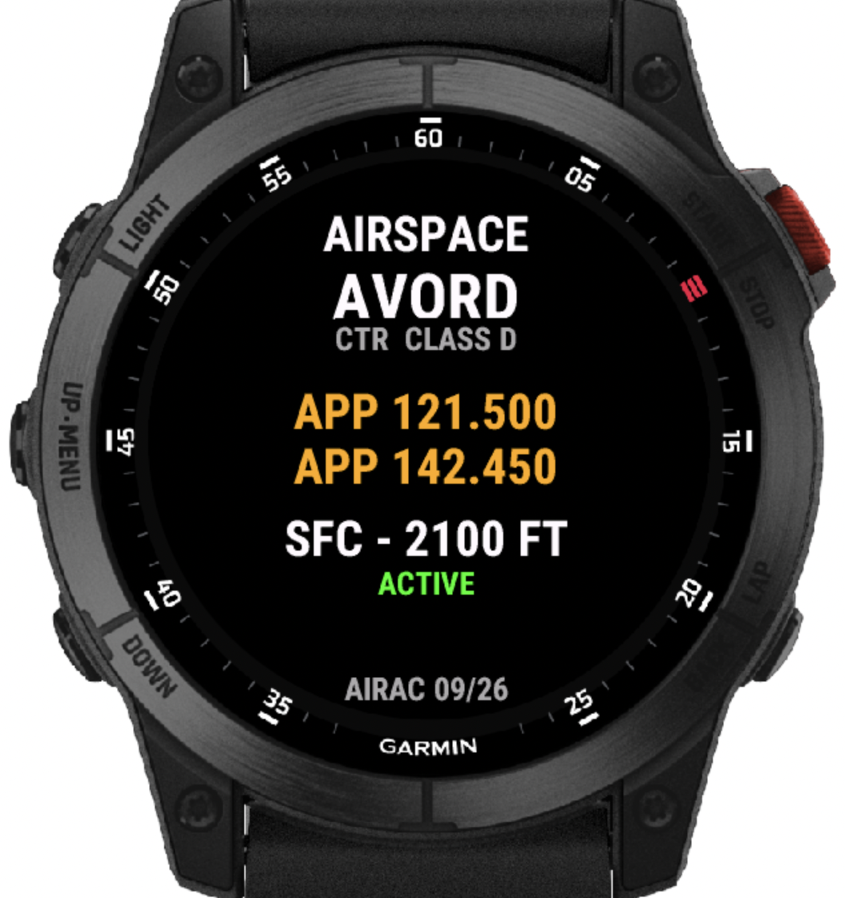

# Flight Trace

Flight Trace is a Garmin Connect IQ flight assistant for compatible Garmin
watches. It records a manually started flight as a Garmin activity and provides
compact offline airport and airspace information.

> **Safety notice:** This is an informational, non-certified flight assistant.
> It must never be the primary source for navigation, airspace status,
> frequencies, runways, or flight decisions. Always cross-check current AIP,
> VAC, NOTAMs, charts, ATC instructions, and approved aircraft equipment.

## Features

- Flight recording with GPS track, altitude, speed, magnetic track and vertical speed.
- Nearest-airport page with ICAO identifier, distance, magnetic bearing, radio frequency and runways.
- Current-airspace page for P, TMA and CTR zones, with class, limits and published frequencies.
- Three pages navigated with the physical `Up` and `Down` buttons.
- Physical `Select` button to start and stop recording. Touch and swipe input are disabled.
- French airport and airspace data bundled offline; no network connection is required on the watch.

## Build

Requirements:

- Garmin Connect IQ SDK 9.2.0 or newer
- Java 11 or newer
- One of the validated Garmin device profiles below
- Monkey C extension for Visual Studio Code

Open the project in Visual Studio Code, choose a device profile, then run
**Monkey C: Build Current Project** and **Run Without Debugging**. Use the
simulator's GPS controls to set a position. The app uses physical simulator
buttons only.

For a physical watch, use **Monkey C: Build for Device**. Never commit the
developer key or generated build files.

## Compatibility

Validated with Connect IQ SDK 9.2.0 on the simulator. Every listed profile was
checked on the three pages with a GPS fix, airport data and active airspace data:

- `epix2`: epix Gen 2 and quatix 7 Sapphire, 416×416
- `fenix7`: fēnix 7 and quatix 7, 260×260
- `fenix7x`: fēnix 7X and Enduro 2 family, 280×280
- `enduro3`: Enduro 3, 280×280
- `fr165`: Forerunner 165, 390×390
- `fr265`: Forerunner 265, 416×416
- `fr955`: Forerunner 955 / Solar, 260×260
- `fr965`: Forerunner 965, 454×454
- `fr970`: Forerunner 970, 454×454

The checks covered the flight, nearest-airport and current-airspace screens:
all displayed fields remained inside the watch face with no text overlap or
clipping. Simulator validation is not a substitute for an on-watch test.

The epix2 is the only profile validated on real hardware. All other profiles
are best-effort simulator validations and should be tested on the target watch
before use.

## Screenshots

<p align="center">
  
  
  
</p>

The airspace page opens with `Down` from the airport page. These are complete
watch-screen simulator captures; always verify the current build and current
aeronautical data before flight.

## Refresh the airspace data

The converter reads an official SIA AIXM 4.5 AIRAC ZIP and generates the compact
Monkey C dataset:

```text
python3 tools/airspace/build_airspace_dataset.py \
  ~/Downloads/export_xml_bd_SIA2026-09-03.zip \
  --airac 09/26 \
  --omit-types R,D \
  --output source/FranceAirspaces.mc \
  --report /private/tmp/airspace-quality.json
```

The epix2 build keeps P, TMA and CTR zones to stay within the watch memory
budget. The full source export is not embedded.

## Data and licence

Original code and documentation: [MIT License](LICENSE).

Airspace data: SIA AIXM AIRAC export under the [SIA open-data licence](https://www.sia.aviation-civile.gouv.fr/pub/media/news/file/l/i/licenceopendata-vf_2.pdf).
Airport data also uses [OurAirports public-domain data](https://ourairports.com/data/)
and documented local references. Details, attribution and redistribution notes
are in [DATA-LICENSE.md](DATA-LICENSE.md).

## Repository layout

```text
source/       Monkey C application and bundled datasets
resources/    App resources and settings
tools/        AIXM converter and tests
assets/       App artwork
```

Run the converter tests with:

```text
python3 -m unittest discover -s tools/airspace -p 'test_*.py'
```
